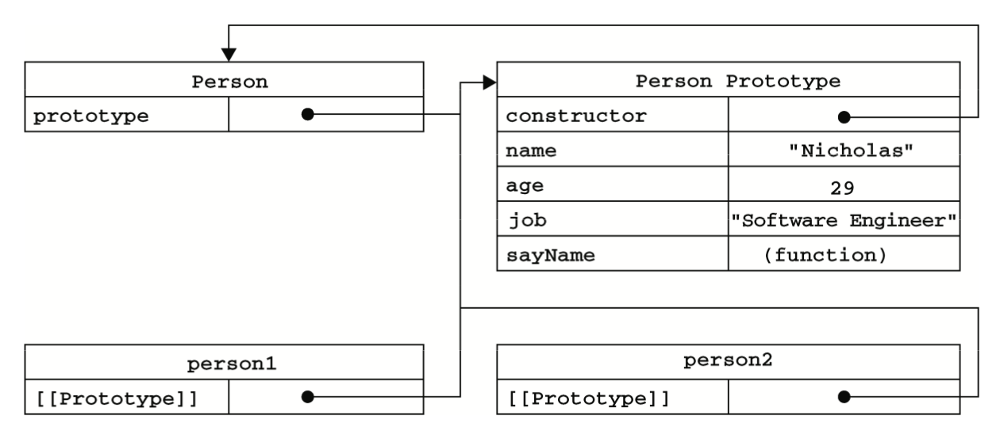

### 一、工厂模式

```javascript
function createPerson(name,age,job){
	var o = new Object();
	o.name = name;
	o.age = age;
	o.job = job;
	o.sayName = function(){
		alert(this.name);
	}
	return o;
}

var person1 = createPerson('luce',26,'software engineer')
```

##### 工厂模式的缺点：
没法解决对象识别的问题（即怎样知道一个对象的类型）

### 二、构造函数模式

> 1.  函数名使用大写字母
> 2. *以这种方式定义的构造函数是定义在Global对象（在浏览器中是window对象）中的。*

```javascript
// Person 为构造函数
function Person(name,age,job){
	this.name = name;
	this.age = age;
	this.job = job;
	this.sayName = function(){
		alert(this.name)
	};
}

var person1 = new Person('luce',25,'doctor')
```

*new*操作符，以这种方式调用构造函数会经历以下4个步骤：
1. 创建一个新的对象；
2. 将构造函数的作用域赋给新对象（因此this就指向了这个新对象）；
3. 执行构造函数的代码（为这个新对象添加属性）；
4. 返回新对象。

对象person1有一个constructor（构造函数）属性，该属性指向Person

`console.log(person1.constructor == Person)  // true`

对象的constructor属性最初是用来标识对象类型的，检测对象类型使用 instanceof 操作符：

`console.log(person1 instanceof Person)  // true`

创建自定义的构造函数意味着将来可以将它的实例标识为一种特定的类型，而这正是构造函数模式胜过工厂模式的地方。

所有对象均继承自Object，所以：

`console.log(person1 instanceof Object)  //true`

构造函数与其他函数的唯一区别，就在于调用它们的方式不同。构造函数也是函数，不存在定义构造函数的特殊语法。任何函数，只要通过new操作符来调用，那它就可以作为构造函数；而任何函数，如果不通过new操作符来调用，那它跟普通的函数没有什么两样。

##### 构造函数模式的缺点：
每个方法都要在每个实例上重新创建一遍，不同实例上的同名函数是不相等的。可以通过把函数定义转移到构造函数外部解决这个问题：
```javascript
function Person(name,age,job){
    this.name = name;
    this.age = age;
    this.sayName = sayName;
}

function sayName(){
    console.log(this.name)
}

var person1 = new Person('Tom',23,'Engineer')
var person2 = new Person('june',25,'Doctor')
```

### 三、原型模式
我们创建的每个函数都有一个prototype（原型）属性，这个属性是一个指针，指向一个对象，而这个对象的用途是包含可以由特定类型的所有实例共享的属性和方法。大白话就是，prototype就是通过调用构造函数而创建的那个对象实例的原型对象，这个原型对象让所有使用该构造函数创建的对象实例共享它的属性和方法。

这样的话，就不必在构造函数中定义对象实例的信息，而是直接将这些信息直接添加到原型对象中：
```javascript
function Person(){}

Person.prototype.name = 'Nuce';
Person.prototype.age = 24;
Person.prototype.sayName = function(){
    console.log(this.name)
};

var person1 = new Person();
person1.sayName(); //"Nuce"

var person2 = new Person();
person2.sayName(); //"Nuce"

console.log(person1.sayName == person2.sayName) //true
```
#### 1. 理解原型对象
在创建一个新函数时，会根据一组特定的规则为该函数创建一个prototype属性，这个属性指向函数的原型对象。在默认情况下，所有原型对象都会自动获得一个constructor（构造函数）属性，这个属性包含一个指向prototype属性所在函数的指针。

创建了自定义的构造函数之后，其原型对象默认只会取得constructor属性；至于其他方法，则都从Object继承而来。当调用构造函数创建一个新实例后，该实例的内部将包含一个指针（内部属性），指向构造函数的原型对象。

<div style="text-align:center">
    
</div>

该图展示了Person构造函数、Person的原型属性以及Person现有的两个实例之间的关系。在此，Person.prototype指向了原型对象，而Person.prototype.constructor又指回了Person。Person的每个实例———person1和person2都包含一个内部属性，该属性仅仅指向了Person.prototype；换句话说，它们与构造函数没有直接的关系。此外，要格外注意的是，虽然这两个实例都不包含属性和方法，但我们却可以调用person1.sayName(),这是通过查找对象属性的过程来实现的。

可以通过Object.getPrototypeOf()来获取实例中的内部属性[[Prototype]]:
```JavaScript
console.log(Object.getPrototypeOf(person1) == Person.prototype); // true

console.log(Object.getPrototypeOf(person1).name); //"Nicholas"
```

虽然可以通过对象实例访问保存在原型中的值，但是却不能通过对象实例重写原型中的值。如果我们在实例中添加了一个属性，而该属性与实例原型中的一个属性同名，那我们就在实例中创建该属性，该属性将会屏蔽原型中的那个属性。

使用delete操作符可以完全删除实例属性，从而让我们能够重新访问原型中的属性

使用hasOwnProperty()方法可以检测一个属性是存在于实例中，还是存在于原型中。
```javascript
console.log(person1.hasOwnProperty('name')); //false
```

#### 2. 原型于 in 操作符
有两种方式使用 in 操作符：单独使用和在 for-in 循环中使用。在单独使用时，in 操作符会在通过对象能够访问给定属性时返回 true，无论该属性存在于实例中还是原型中。在使用 for-in 循环是，返回的是所有能够通过对象访问的、可枚举的属性，其中既包括存在于实例中的属性，也包括存在于原型中的属性。

要取得对象上所有可枚举的*实例属性*，可以使用Object.keys()方法。这个方法接收一个对象作为参数，返回一个包含所有可枚举属性的字符串数组。

#### 3. 更简单的原型语法
```javascript
function Person(){}

Person.prototype = {
	name: 'Nicholas',
	age: 28,
	job: 'Engineer',
	sayName: function(){
		console.log(this.name)
	}
}
```
上面的代码，我们将Person.prototype设置为定于一个以对象字面量形式创建的新对象。最终结果相同，但是有一个列外：constructor的属性不再指向Person。前面曾经介绍过，每创建一个函数，就会同时创建它的prototype对象，这个对象也会自动获得constructor属性。而我们在这里使用个语法，本质上完全重写了默认的prototype对象，因此，constructor的属性也就变成了新对象的constructor属性（指向Object构造函数），不再指向Person函数。

如果constructor真的很重要，可以特意将它设置回适当的值：
```javascript
function Person(){}

Person.prototype = {
	constructor: Person,
	name: 'Nicholas',
	age: 28,
	job: 'Engineer',
	sayName: function(){
		console.log(this.name)
	}
}
```
#### 4. 原型的动态性
由于在原型中查找值的过程是一次搜索，因此我们对原型对象所做的任何修改都能够立即从实例上反映出来，即使是先创建了实例后修改原型也照样如此。

但是如果是重写整个原型对象，那么情况就不一样了。我们知道，调用构造函数时会为实例添加一个指向最初原始的[[Prototype]]指针，而把原型修改为另一个对象就等于切断了构造函数与最初原型之间的联系。请记住：实例中的指针仅指向原型，而不指向构造函数。

### 四、组合使用构造函数模式和原型模式
*这是一种最常见的创建对象的模式*。构造函数模式用于定义实例的属性，而原型模式用于定义方法和共享的属性。结果，每个实例都会有自己的一份实例属性的副本，但同时又共享着对方法的引用，最大限度地节省了内存。另外，这种混成模式还支持向构造函数传递参数，可谓是集两种模式之长。
```javascript
function Person(name,age,job){
	this.name = name;
	this.age = age;
	this.job = job;
	this.friends = ["Shelyby","Court"];
}

Person.prototype = {
	constructor: Person,
	sayName = function(){
		console.log(this.name);
	}
}
```

### 五、动态原型模式
有其它OO语言经验的开发人员在看到独立的构造函数和原型时，很可能感到困惑。动态原型模式正式致力于解决这个问题的一个方案，它把所有信息都封装在了构造函数中，而通过在构造函数中初始化原型（仅在必要的情况下），又保持了同时使用构造函数和原型的有点。换句话说，可以通过检查某个应该存在的方法是否有效，来决定是否需要初始化原型。
```javascript
function Person(name,age,job){
	this.name = name;
	this.age = age;
	this.job = job;

	if(typeof this.sayName != 'function'){
		Person.prototype.sayName = function(){
			console.log(this.name)
		}
	}
}
```
*使用动态原型模式时，不能使用对象字面量重写原型。前面已经解释过了，如果在已经创建了实例的情况下重写原型，那么就会切断现有实例与新原型之间的联系*

### 六、寄生构造函数模式
### 七、稳妥构造函数模式
